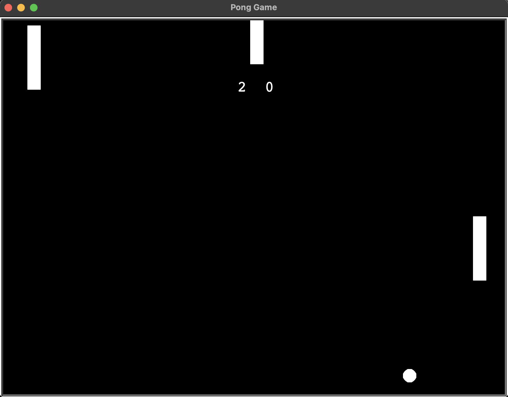

# Pong Arcade Game

A classic Pong arcade game implementation built with Python and the Turtle graphics library. This recreation features the iconic two-player experience with smooth paddle movement, increasing ball speed, and score tracking.

## Features

- Classic two-player gameplay
- Smooth paddle and ball movement
- Dynamic ball speed that increases with each hit
- Score tracking system
- Collision detection with walls and paddles
- Realistic ball trajectory and rebounds
- Clean, minimalist visual design

## Installation

1. Clone this repository:

**git clone https://github.com/sultan7557/Pong-Arcade-Game.git**

2. Navigate to the project directory:

**cd Pong-Arcade-Game**

3. Make sure you have Python installed (Python 3.6 or higher recommended)

4. Run the game:

**python main.py**

## How to Play

Pong is a simple table tennis simulation where two players control paddles on opposite sides of the screen. The objective is to score points by hitting the ball past your opponent's paddle.

1. Player 1 (right side) uses the **Up** and **Down** arrow keys
2. Player 2 (left side) uses the **W** key (up) and **S** key (down)
3. The ball speeds up every time it hits a paddle, making the game progressively more challenging
4. The game continues until you close the window

## Game Controls

| Player | Move Up | Move Down |
|--------|---------|-----------|
| Right  | ↑ (Up Arrow) | ↓ (Down Arrow) |
| Left   | W | S |

## Code Structure

The game is built with a clean, object-oriented approach:

- **main.py**: Game initialization and main loop
- **paddle.py**: Paddle class that handles movement and positioning
- **ball.py**: Ball class with movement, collision, and speed dynamics
- **scoreboard.py**: Scoreboard class for score display and tracking

## Technologies Used

- Python 3
- Turtle Graphics Library

## Future Improvements

- Add a start screen and menu
- Implement AI opponent for single-player mode
- Add sound effects
- Include power-ups and special abilities
- Create difficulty levels

## License

This project is open source and available under the MIT License.

## Acknowledgements

- Inspired by the original Pong game created by Atari in 1972
- Built as a learning project to understand game development concepts in Python

---

*Created by Ali Sultan*